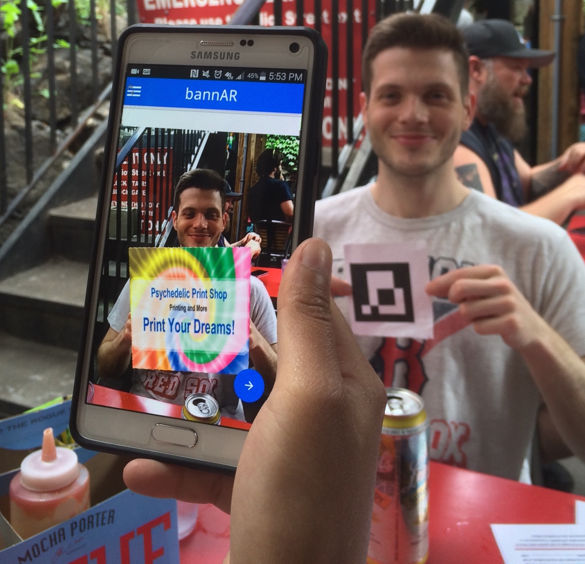

# bannAR #
Use augmented reality to preview banners (and other printed products) in your own space

*Winner of 2nd Place at the [2016 Cimpress Open Hackathon](2016hackathon.com)*

## Demos ##
* Color (e.g. Post-it) markers: https://chriskwan.github.io/bannAR/pixel-check/
* QR code markers with banner preview: https://chriskwan.github.io/bannAR/aruco/debug-posit.html

